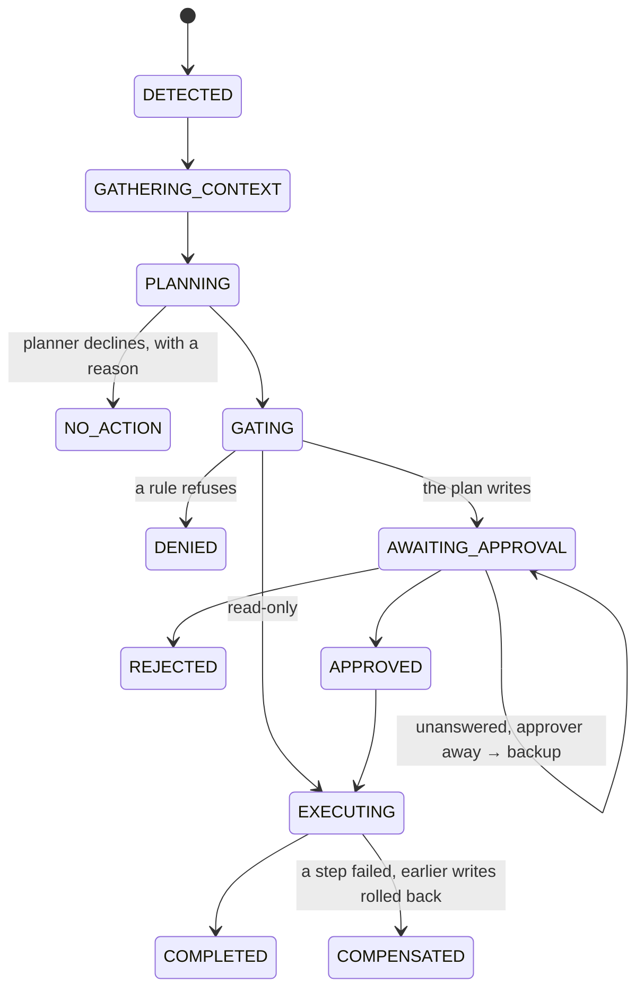

# Harmony

An extendable agent harness for enterprise work. Every employee gets an agent that
notices things without being asked, reasons across the systems they can see,
proposes what to do, and acts only within their permissions and with their consent.

Two scenarios run end to end: a purchase-order reroute through a declared workflow,
and a quality-hold reallocation through free-form planning.

---

## Run it

```bash
python -m venv .venv
.venv/Scripts/python -m pip install -e ".[dev]"     # Windows
# .venv/bin/python -m pip install -e ".[dev]"       # macOS / Linux

.venv/Scripts/harmony demo all
```

That is Scenario A from detection through approval and execution, the clock
advancing so the follow-up fires, then Scenario B, then eight failure cases.

**No API key is needed.** The model's side of every exchange replays from
`cassettes/`. See [The model](#the-model) for what that means and what it does not.

A `Makefile` exists as a convenience for anyone who has `make`, but it is not the
documented path — a headline command that works on two platforms out of three is
not one command.

<details>
<summary>Driving it yourself, step by step</summary>

```bash
harmony init                          # seed the world at 2026-09-02
harmony detect --user u-101           # what Dana's agent notices, without acting
harmony run --user u-101              # take it through the loop to a decision
harmony approvals list
harmony approvals show APR-xxxx       # the card a manager actually sees
harmony approvals approve APR-xxxx    # decide, and execute
harmony clock advance 2026-09-04      # fires the scheduled arrival check
harmony audit explain RUN-xxxx        # reconstruct the run from the ledger
harmony catalog tools                 # what is registered
harmony doctor                        # am I calling the real model, or replaying?
harmony serve                         # the same approvals over HTTP, docs at /docs
```
</details>

```bash
.venv/Scripts/python -m pytest        # 116 tests
.venv/Scripts/harmony eval            # recommendation quality, 6 golden cases
```

---

## The one structural idea

Two top-level packages, and the boundary between them is the architecture.

```
harmony/       the product.  Runs, tools, scopes, workflows, audit, scheduling.
               Knows nothing about parts, purchase orders, lots or suppliers.

northfield/    one customer. Seed data, system connectors, detectors, tools,
               policy, profiles, workflow definitions.
```

The kernel never imports the company. Deployments register themselves through a
packaging entry point and the harness discovers what is installed:

```toml
[project.entry-points."harmony.deployments"]
northfield = "northfield:DEPLOYMENT"
```

Both halves of that claim are enforced rather than asserted:

```bash
pytest tests/architecture/            # 7 tests
```

`test_the_kernel_contains_no_manufacturing_vocabulary` greps the kernel's *code*
(docstrings are exempt — they cite concrete examples constantly, because that is
how you explain a general mechanism). `test_the_kernel_never_imports_the_company`
walks the AST. That second test is the reason the entry point exists: it caught the
CLI doing `from northfield import DEPLOYMENT`, and a hardcoded default string would
have been the same dependency wearing a disguise.

---

## Where each requirement lives

| The brief asks for | It lives in |
|---|---|
| detecting attention items on a schedule or event | `harmony/detect/` |
| gathering context per system, scoped to the user | `harmony/providers/` |
| planning: item + context → actions, with reasoning | `harmony/plan/` |
| gating: permissions, policy, approval routing, in code | `harmony/gate/` |
| executing with idempotency and compensation | `harmony/tools/`, `harmony/execute/` |
| memory: this run versus across runs | `harmony/memory/` |
| deferred work that survives a restart | `harmony/schedule/` |
| append-only audit of every step | `harmony/audit/` |
| declared workflows (Part 2) | `harmony/workflow/` |

`harmony/runtime/orchestrator.py` composes those nine and holds none of their
logic. If it ever reads as anything other than the state machine in
`harmony/runtime/run.py`, the change belongs in a subsystem instead.

---

## The run lifecycle



`AWAITING_APPROVAL` is the interesting state: a run sits there across a restart,
across a change of approver, and across days of simulated time. It is the only
state whose exit is caused by a person rather than by the process.

---

## Where the model is allowed to act

Four call sites, all of them through one function — `harmony/llm/structured.py::ask`.

| Call site | Input | Allowed output | Enforced by | Can it write? |
|---|---|---|---|---|
| `mail.extract_commitment` | one email body, plus the POs it could concern | `{po_id, revised_arrival_date, confidence, verbatim_quote}` | pydantic; `po_id` must be one of those supplied | no |
| `planner` | attention item, context bundle, tool and workflow catalogs | a typed `Proposal` | pydantic; names checked against the catalog; workflow params against the declared schema | no — proposes only |
| `workflow.po_reroute.choose_supplier` | candidates a prior deterministic step computed | `{supplier_id ∈ enum, justification ≤ 400 chars}` | a `Literal[...]` built at run time, plus a guardrail | no |
| `workflow.po_reroute.draft_notification` | structured facts | `{subject ≤ 120, body ≤ 1500}` | length limits, plus a must-mention guardrail | no |

**Language in, structure out.** The model reads prose and proposes. Code owns every
number, every ordering decision, every permission check and every write.

Concretely, in Scenario A: the model turns *"puts it on your dock Tuesday 9/8"* into
`2026-09-08`. Then the detector does the arithmetic — 150 on hand at 30/day is five
days of cover, production order 4812 starts in five days needing 120, the revised
arrival of 09-08 falls after the 09-07 start, so projected stock at start is zero
and the shortfall is 120. No model judgment touches any of that.

Bounds are applied in three layers, cheapest first: **schema** (the model is given
the answer's shape and forced to use it, so prose is not an available move),
**validation** (pydantic), and **guardrails** (things a schema cannot express, like
"the notification must name the production order it is about"). A rejection is
audited with the offending output, retried once, then fails closed. There is no path
where an out-of-bounds answer is used anyway; failure case 7 demonstrates it.

---

## The declared workflow

Purchasing's requirement was blunt:

> *"We don't want the AI improvising a PO reroute. The steps are fixed... In that
> order. Every time."*

So the order lives in `northfield/workflows/po_reroute.v3.yaml`, which a purchasing
analyst can read, and `harmony/workflow/engine.py` is an interpreter with no opinion
about what the steps mean. The planner decides *whether* to enter and supplies the
parameters; it never sees the definition.

```
1  find_approved_suppliers    tool   confirm qualified for the part   on_empty: fail
2  filter_by_lead_time        tool   confirm lead time meets the date on_empty: fail
3  choose_supplier            llm    bounded choice + justification
4  create_replacement_po      tool   → undone by erp.cancel_purchase_order
5  reduce_original_po         tool   → undone by erp.restore_purchase_order
6  draft_notification         llm    prose, guardrailed
7  notify_production          tool   irreversible: true
8  schedule_arrival_check     tool   → undone by schedule.cancel_followup
```

Two things worth noticing.

**The steps are ordered by reversibility as well as by business logic.** Every
compensable write comes before the one irreversible effect. That is not incidental:
the same six business steps in the order "notify first, buy second" would leave a
supervisor acting on a purchase order that does not exist. The loader refuses to
load a write step that declares neither a compensation nor `irreversible: true`, so
rollback is always a decision somebody made rather than an oversight.

**The model steps are bounded by their neighbours.** `choose_supplier` looks like
the model making a purchasing decision. It is not: step 1 computed who is qualified,
step 2 removed anyone too slow, and `enum_from` restricts the answer to what
survived. In the seed data that leaves exactly one candidate. Halstead Precision is
qualified *and* cheaper than Meridian; a nine-day lead time removes it before the
model ever sees it.

Progress is a cursor advanced in the same transaction that records a step's result,
so a killed process resumes at exactly the right place. Definitions carry a version
and instances pin the one they started with.

---

## Extending it

### A tool

```python
@tool("quality.reallocate_lot",
      description="Move a production order's allocation from one lot to another.",
      scopes={"quality:lot:allocate"},
      input=ReallocateLotInput, output=ReallocateLotOutput,
      writes=True, compensation="quality.revert_lot_allocation")
def reallocate_lot(session: Session, inp: ReallocateLotInput) -> ReallocateLotOutput:
    store = session.services.store
    ...
```

You get scope checking, input validation, idempotency, auditing and compensation
wiring for free. The invoker does all of it, in a fixed order, for every tool. Do
not re-check authorisation inside the function; the two checks would drift.

### A provider

```python
@provider("quality",
          description="Lot-tracked inventory, holds, and open shortage flags.",
          required_scopes={"quality:lot:read"})
def quality_provider(session: Session, request: ContextRequest) -> ContextSlice:
    slice_ = ContextSlice(system="quality", provider="northfield.quality")
    slice_.collections["lots"] = ...
    slice_.redactions.append(Redaction(collection="lots", count=n, reason="..."))
    return slice_
```

Report what you withheld. That is the difference between an audit trail showing what
the agent read and one showing what it *could* read — and only the second lets a
reviewer tell an oversight from a permission boundary.

### A detector

```python
@detector("lot_hold_allocation_risk",
          description="Production allocated to a lot on quality hold.",
          systems={"quality", "erp"},
          required_scopes={"quality:lot:read", "erp:production:read"})
def detect(ctx: DetectorContext) -> Iterable[AttentionItem]:
    bundle = ctx.scan(purpose="...", horizon_days=10)
    yield AttentionItem.build(detector_id=..., facts=..., evidence=..., ...)
```

Build items with `AttentionItem.build` so their dedupe hashes are derived
consistently — a detector author cannot get dedupe subtly wrong. Return findings,
not conclusions: whether the facts warrant action is the planner's judgment.

### A workflow

Drop a YAML file in `northfield/workflows/` and bind it in a profile. Every tool it
names, every compensation, and every `${...}` binding is validated at start-up, so a
typo fails on boot rather than mid-reroute.

### A person's agent

A profile is a binding, not code:

```yaml
id: quality_manager
assigned_to: [u-202]
detectors: [lot_hold_allocation_risk]
providers: [quality, erp, mail]
tools: [quality.*, purchasing.raise_shortage_flag, production.notify_supervisor]
workflows: []          # empty — this agent plans freely
scopes: [quality:lot:read, quality:lot:allocate, ...]
```

`scopes` is what the profile *needs*. It is intersected with the user's
entitlements, never added to them. Dana holds `mail:send`; her profile does not ask
for it; her agent cannot send mail as her.

---

## The model

`harmony doctor` answers "am I actually calling the API?" — it reports the mode,
whether a key is set, which model, and where the cassettes came from. After a run,
`harmony audit explain <run>` shows every model call with the model name and token
counts, so `model=scripted-fixture, in=0, out=0` and
`model=claude-sonnet-4-5, in=3412, out=210` are told apart at a glance.

The shipped cassettes are **authored fixtures, not live recordings.** They come from
`northfield/demo/scripted_answers.py`, and each cassette records
`"source": "fixture"` so you can tell. They exist so `harmony demo all` works on a
clean checkout with no key and no cost, and so tests are deterministic.

To replace them with genuine recordings, put a key in `.env`:

```bash
cp .env.example .env
# edit .env:  ANTHROPIC_API_KEY=sk-ant-...
```

`.env` is gitignored and is loaded automatically by `harmony` and by the scripts in
`scripts/`. An exported environment variable always wins over the file, so
`HARMONY_LLM=live harmony eval` overrides whatever is set there. Then:

```bash
HARMONY_LLM=record python scripts/author_cassettes.py   # re-record every cassette
harmony eval --live                                     # golden cases, real model
```

The live client is exercised only by a contract test through a fake transport
(`tests/unit/test_anthropic_contract.py`), which catches a schema the API would
reject, a request that forgets to force the tool, and a parser that misses the
`tool_use` block — but **the live path has not been run against the real API.**
Treat that as outstanding.

Runs are deterministic end to end. Identifiers minted by tools derive from the
call's idempotency key, run ids from the situation, workflow instance ids from the
run. This started as a replay problem — prompts downstream of a write embed the
identifiers it produced, so random ids made every recorded exchange unrepeatable —
and turned into a property worth having on its own: a run you cannot reproduce is a
run you cannot investigate.

---

## Failure cases

`harmony demo run failures` runs eight, each against the real orchestrator and gate.

| | What happens |
|---|---|
| 1 | **Scope denial.** Alex is cc'd on the supplier's email and reaches the same conclusion Dana does. He lacks `erp:po:create`; the gate denies the plan whole, before anything runs. |
| 2 | **Value escalation.** £37,600 exceeds Dana's £25,000 limit, so it routes to her director. |
| 3 | **Out-of-office routing.** Unanswered at end of day, Dana out tomorrow → the backup, bound to the same plan digest. |
| 4 | **The unqualified supplier.** Apex is cheapest, fastest, and not qualified for the part. Refused at three independent layers. |
| 5 | **Compensation.** A late failure rolls back earlier writes in reverse order. |
| 6 | **Crash and resume.** Killed mid-workflow, resumed from the cursor, exactly one purchase order. |
| 7 | **The model out of bounds.** A supplier outside the candidate enum, and an invented tool name. Both refused. |
| 8 | **Trigger dedupe.** Three sweeps, one alert; then the facts change and it supersedes. |

---

## Tests

```
tests/unit/           82   the gate, dedupe, resumption, scoping, approvals, the model client
tests/integration/    27   both scenarios end to end, the HTTP surface, the eval suite
tests/architecture/    7   invariants this README claims
```

Plus six golden recommendation-quality cases (`harmony eval`) asserting on
properties of the decision — action kind, workflow entered, parameters, evidence
cited, traps avoided — never on wording, because a suite that fails on every rewrite
is a suite people delete. Half of them assert *silence*: a suite of only positive
cases passes an agent that alerts on everything.

CI runs all of it and then regenerates `docs/runs/scenario-a.md`, failing on a diff
— so the recorded run cannot drift from what the code does.

---

## What I cut, and why

- **No UI.** The brief said a CLI or an HTTP endpoint is fine; both exist. A web
  front end would have been presentation work, not architecture.
- **HTTP auth is a fake header.** `X-Harmony-User`, replaced by a validated OIDC
  token in a real deployment. A homegrown auth scheme that would be thrown away
  teaches a reviewer nothing; DESIGN.md has the real design.
- **HTTP approval executes inline.** Right at this scale, wrong at any other — a
  ninety-second workflow should not hold a connection open. The durable queue is
  already the seam.
- **Durable memory is thin on purpose.** The interface is what I was designing —
  provenance, TTL, contradiction, advisory-only. The implementation writes and reads
  a handful of facts. The interesting part of that problem is the policy, not the
  storage.
- **Single-process, one SQLite writer**, explicitly serialised under a lock. This
  is the first wall, and DESIGN.md says where it is.
- **No in-flight workflow version migration.** Instances pin their version; the
  brief said this was a design-doc question.
- **No retry taxonomy.** One retry on a rejected model answer, then fail closed. No
  backoff, no dead-letter queue.
- **One profile per person.** Multiple profiles need a merge rule for overlapping
  detectors, which is real work.
- **No multi-level MRP netting, partial shipments, or multi-lot splits.** All
  realistic; none changes an interface.
- **Free-form plans get no resumption or compensation guarantees.** This is the
  honest one. `harmony/execute/executor.py` documents exactly what is weaker, and
  it is the same gap DESIGN.md's Part 2 answer turns on.

## One divergence from the brief

The brief says the agent *"schedules a check for Tuesday"*. Tuesday was the
*delayed* supplier's date. Because the reroute succeeds, the replacement is due
Friday 09-04, and that is when a check is worth running — so the workflow schedules
against the replacement's promised date rather than a date from the story. The demo
says so where it happens. I think the generalisation is right, but it is a visible
difference and worth stating rather than leaving to be noticed.
