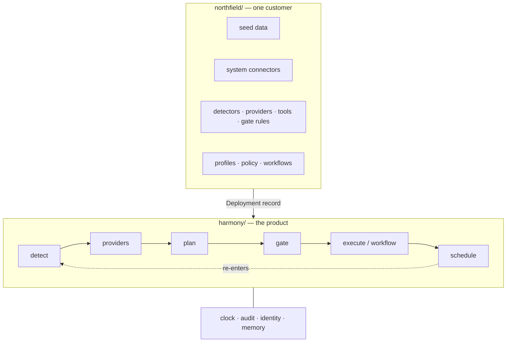
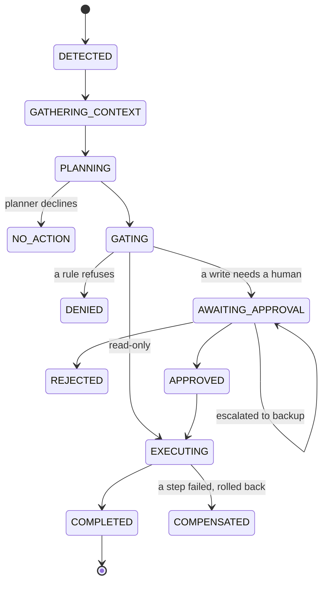

# Writing guide — MODEL.md, README, DESIGN.md

Scaffolding for the three documents you're writing yourself. For each: the section
structure, the *claim* each section has to land, the evidence in this repo to point
at, and worked substance for the questions the brief actually cares about.

Delete this file before you ship.

**One rule that applies to all three.** Every claim should be checkable by a
reviewer in under a minute, and you should tell them how. "The kernel is
domain-agnostic" is a sentence anyone can write. "`grep -rIn --include=*.py -E
'\b(purchase_order|supplier|part_id)\b' harmony/` returns nothing, and
`tests/architecture/test_kernel_purity.py` fails the build if it ever doesn't" is
an argument.

---

## Facts you can cite

Verified as of this build. Re-check anything you quote.

| Fact | How to check |
|---|---|
| 99 tests pass, including 7 architecture tests | `make test` |
| 6 golden cases pass in replay *and* live against claude-haiku-4-5 | `harmony eval` / `harmony eval --live` |
| The 15 shipped cassettes are real recordings | `grep '"source"' cassettes/*.json` |
| ~9,700 lines in `harmony/`, ~4,800 in `northfield/`, ~2,100 in `tests/` | `find harmony -name '*.py' \| xargs wc -l \| tail -1` |
| 15 tools, 3 detectors, 4 providers, 4 gate rules, 3 profiles, 1 workflow | `harmony catalog tools` / `detectors` / `profiles` |
| Approvals work over CLI *and* HTTP, through the same orchestrator | `harmony serve`, then `tests/integration/test_http.py` |
| No manufacturing vocabulary in the kernel | `pytest tests/architecture/test_kernel_purity.py` |
| The kernel never imports `northfield` | same file, `test_the_kernel_never_imports_the_company` |
| Nothing reads the wall clock outside `harmony/kernel/clock.py` | same file, `test_nothing_outside_the_clock_module_reads_the_wall_clock` |
| Everything Scenario B needed lives under `northfield/` | 5 files: `providers/quality.py`, `detectors/lot_hold_allocation_risk.py`, `tools/quality.py`, `profiles/quality_manager.yaml`, `seed/quality_lots.yaml` |
| The gate has exactly 4 rules, unchanged by Scenario B | `tests/integration/test_scenarios.py::test_scenario_b_needed_no_new_gate_rule` |
| Scenario A's run is byte-for-byte reproducible | `make demo-a` twice; the run id is `RUN-6cf0ff` both times |
| The recorded run is generated from the ledger alone | `make recorded-run` → `docs/runs/scenario-a.md` |

### Three defects the work found, and why they are worth mentioning

Reviewers discount claims and credit evidence. Each of these is evidence that the
mechanism you built actually does something, and each is a better story than "I
designed it correctly."

**The architecture test caught the kernel importing the company.** `harmony/cli/main.py`
had `from northfield import DEPLOYMENT`. The fix was not to exempt the CLI — a
hardcoded default string is a hardcoded dependency wearing a disguise — but to make
deployments register through a `harmony.deployments` packaging entry point
(`harmony/runtime/discovery.py`). The kernel now discovers what is installed.

**Replay mode caught the runs being irreproducible.** Prompts downstream of a write
embed the identifiers it produced — the drafted notification names the new purchase
order — so random ids made every prompt, and therefore every recorded exchange,
unrepeatable. Identifiers minted by tools now derive from the call's idempotency
key, run ids from the situation, workflow instance ids from the run. A replayed
write yields the same identifier and a whole run is reproducible. This is worth a
paragraph in the README: it started as a testing problem and turned into a property
worth having for its own sake, because a run you cannot reproduce is a run you
cannot investigate.

**Standing up the HTTP server caught a threading bug.** `Store` held one SQLite
connection bound to its creating thread; any real server hands requests to a pool.
Access is now serialised under a re-entrant lock held for the whole transaction —
releasing between statements would let a second thread interleave writes inside
somebody else's transaction. Say this plainly and connect it to the scaling answer:
it is the single-writer design stated honestly, and it is the first wall.

**One more, smaller:** writing the eval cases showed that a `forbids` check against
the whole proposal punished a model for *naming a trap in order to reject it* —
which is the behaviour you want. It now checks the proposed action only. Good
illustration that eval design is itself a design problem.

---

## MODEL.md

**Length:** 1.5–2 pages. **Claim:** every entity and every field exists because a
scenario or a control needs it, and you can name which.

### 1. The company, in five sentences
Northfield Manufacturing, conveyor drive units and bearing housings, three lines,
seven people modelled. Say that the model is small on purpose and that the brief
asked for that.

### 2. Entity table: kept / changed / added / omitted
One row per entity, one column for why. The four **additions** and their
justifications:

- **`goods_receipts`** — without it the Tuesday arrival check has nothing to check.
  It's the difference between the follow-up asking "did the goods arrive?" and
  asking "does the PO still say it will?". Smallest addition, biggest honesty
  payoff.
- **`on_time_rate` on suppliers** — gives the model's supplier choice a basis other
  than price, which is what makes `choose_supplier` a real judgment rather than a
  `min()`. Also seeds the long-term-memory story in DESIGN.md.
- **`shortage_flags`** — Scenario B's escalation path. Deliberately a *record* rather
  than an email, so purchasing's own detectors could pick it up. One agent creating
  work another agent can find is the shape the platform is ultimately for.
- **`notifications`** — so "was the supervisor told?" is answerable from the system,
  not only from the audit log.

**Omitted, each with one line:** BOM explosion, multi-level MRP netting, currencies,
receiving inspection, cost accounting, partial shipments. The framing that does work
here: *"not needed for the scenarios, and adding it would not change any
interface"* — that second clause is the point.

**Call out one simplification honestly.** `material_shortfall` uses a 14-day horizon
and `daily_usage` as baseline consumption, standing in for real MRP netting. Say
what a real planning run would do instead. Also say that lot-tracked parts are
excluded from that detector and answered by `lot_hold_allocation_risk` instead,
because an aggregate on-hand figure is the wrong basis when a quality hold can make
a well-stocked part unavailable.

### 3. The noise inventory — the section reviewers will actually read

| Distractor | What it proves |
|---|---|
| **Apex Rapid Supply (S-Q)** — approved vendor, £38.00 vs Meridian's £46.50, next-day delivery, an unsolicited quote in Dana's inbox (M-005), **not qualified for P-4471** | Three independent refusals. Failure case 4. |
| **Halstead Precision (S-W)** — qualified *and* cheaper than Meridian, 9-day lead time | The lead-time filter step is a real gate, not a lookup |
| **Production order 4835** — consumes P-4471, starts 2026-09-25 | Detector precision: must not alarm |
| **P-2218 in order 4812** — same order, comfortably covered | Must not alarm on every component of an at-risk order |
| **P-3390** — below safety stock, PO-77801 arriving in time | A naive safety-stock detector would raise it |
| **M-003** — same supplier, same week, reads like a delay notice, revises nothing | Extraction precision |
| **M-007** — between two other people | Provider scoping; withheld and *recorded as withheld* |
| **L-2088, L-2065, L-2077** — released-but-allocated, scrapped, wrong part | One distractor per filter in the covering-lot search |
| **E-002 / E-005** — a meeting on the day in question, and OOO three weeks later | Busy ≠ absent; "out tomorrow" ≠ "ever out" |

Then the sentence that ties it together: **the delay exists only in prose.** On
PO-77812's promised date of 09-04 there is no problem at all — the goods arrive
three days before production starts. It is Kestrel's sentence *"puts it on your dock
Tuesday 9/8"* that creates the shortfall, and there is a test asserting that
deleting M-001 makes the alarm go away
(`test_the_delay_email_is_what_creates_the_problem`). That is the load-bearing
argument for having a model in the loop at all.

### 4. Permission matrix
A grid of users × scopes. Point at the two absences that do work: Priya has no
`erp:po:create` (so quality escalates rather than buys), and Alex has none either
(so he can see the shortfall and not fix it). Note that Alex is *cc'd on M-001* on
purpose — same data, same detector, same conclusion, different authority.

### 5. Harness tables vs. company data
Reviewers conflate these. `runs`, `audit_events`, `attention_items`,
`approval_requests`, `proposals`, `workflow_instances`, `scheduled_tasks`,
`idempotency_records`, `memory_facts` are **harness** tables and exist for any
customer — they're in `harmony/kernel/migrations.py`. Parts, POs and lots are
Northfield's, in `northfield/migrations.py`. Two migration sets, applied to one
database, deliberately never mixed.

### 6. The clock
2026-09-02, simulated, persisted in `clock_state`, forward-only. Say why
forward-only: a backwards clock would make already-fired scheduled tasks come due
again.

---

## README

**Length:** 2 pages plus tables. **Claim:** you can run this in one command,
understand the architecture in ten seconds, and add a tool in ten lines.

### Structure

1. **One command**, above the fold:

       pip install -e ".[dev]"
       harmony demo all

   Say explicitly: no API key needed, the model's side is replayed from
   `cassettes/`. Mention the Makefile as a convenience and *not* as the documented
   path — a reviewer on Windows has no `make`, and a headline command that works on
   two platforms out of three is not one command. (This was found by trying to run
   it: `make` is not installed on the machine this was built on.)
2. **The one structural idea** — `harmony/` is a product, `northfield/` is a
   customer, and here is how to check.
3. **Requirement → module table** (below).
4. **Architecture and lifecycle diagrams** (mermaid, below).
5. **The LLM boundary table** (below).
6. **Four recipes:** add a tool / provider / detector / workflow.
7. **What I cut and why.**

### Requirement → module table

| The brief's requirement | Where it lives |
|---|---|
| detecting attention items on a schedule or event | `harmony/detect/` |
| gathering context per system, scoped to the user | `harmony/providers/` |
| planning: item + context → actions, with reasoning | `harmony/plan/` |
| gating: permissions, policy, approval routing, in code | `harmony/gate/` |
| executing with idempotency and compensation | `harmony/tools/`, `harmony/execute/` |
| memory: this run vs. across runs | `harmony/memory/` |
| deferred work that survives a restart | `harmony/schedule/` |
| append-only audit of every step | `harmony/audit/` |
| (Part 2) declared workflows | `harmony/workflow/` |

### The LLM boundary table

Put this high. It's the clearest evidence you thought about where a model belongs.

| Call site | Input | Allowed output | Enforced by | Can it write? |
|---|---|---|---|---|
| `mail.extract_commitment` | one email body + the POs it could concern | `SupplierCommitment{po_id, revised_arrival_date, confidence, verbatim_quote}` | pydantic; `po_id` must be one of those supplied | no |
| `planner` | attention item + context bundle + tool/workflow catalogs | `PlannerOutput` → typed `Proposal` | pydantic; names checked against the catalog; workflow params against the declared schema | no — proposes only |
| `workflow.po_reroute.choose_supplier` | candidates a prior deterministic step computed | `{supplier_id ∈ enum, justification ≤ 400 chars}` | `Literal[...]` built at run time + `must_choose_from` guardrail | no |
| `workflow.po_reroute.draft_notification` | structured facts | `{subject ≤ 120, body ≤ 1500}` | length limits + `must_mention` guardrail | no |

The sentence to write underneath: **language in, structure out.** The model reads
prose and proposes; code owns every number, every ordering decision, every
permission check and every write. Then the concrete illustration: the model turns
*"puts it on your dock Tuesday 9/8"* into `2026-09-08`; the detector does
`150 / 30 = 5 days`, compares `09-08 > 09-07`, and reports a shortfall of 120.

Worth adding: every model call goes through one function, `harmony/llm/structured.py::ask`.
Bounds are applied in three layers — schema (the model is *given* the answer's
shape and forced to use it), validation (pydantic), guardrails (things a schema
can't express). A rejection is audited with the offending output, retried once,
then fails closed. There is no path where an out-of-bounds answer is used anyway;
failure case 7 demonstrates it.

### Diagrams

````markdown



````

### The four recipes

Each should be ~10 lines of real code. If one needs more, the abstraction is wrong
and you should fix the code rather than the prose. Copy the shapes from
`northfield/tools/erp.py`, `northfield/providers/quality.py`,
`northfield/detectors/po_arrival_check.py`, and
`northfield/workflows/po_reroute.v3.yaml`. Add one line each on what the harness
does for you automatically: scope checks, idempotency, auditing, load-time
validation.

### What I cut — be specific and unapologetic

This is graded. Each gets one sentence on why it was right to drop *given three
days*, and one on what replaces it.

- **No UI.** The brief said a CLI or an HTTP endpoint is fine; both exist
  (`harmony approvals ...` and `harmony serve`). A web front end would have been
  presentation work, not architecture.
- **HTTP auth is a fake header.** `X-Harmony-User`, replaced by a validated OIDC
  token in a real deployment. Shipping a homegrown auth scheme that would be thrown
  away teaches a reviewer nothing; the module docstring says so, and DESIGN.md has
  the real design.
- **HTTP approval executes inline.** Right at this scale, wrong at any other — a
  ninety-second workflow should not hold a connection open. The durable queue is
  already the seam.
- **No real IdP.** DESIGN.md has the token-exchange design; implementing it would
  have proved nothing the `Session` object doesn't already show.
- **Durable memory is thin on purpose.** The interface is right — provenance, TTL,
  contradiction, advisory-only — and the implementation writes and reads a handful
  of facts. The interesting part of that problem is the policy, not the storage.
- **Single-process, single SQLite writer.** The seam that would split it is the
  durable task queue, which already exists; DESIGN.md says where it breaks.
- **No in-flight workflow version migration.** Instances pin their version. The
  brief explicitly said this was a design-doc question.
- **No retry taxonomy.** One retry on a rejected model answer, then fail closed. No
  backoff, no dead-letter queue.
- **One profile per person.** `ProfileCatalog.for_user` raises on two. Multiple
  profiles need a merge rule for overlapping detectors, which is real work.
- **No partial-shipment or multi-lot-split modelling.** Both are realistic and
  neither changes any interface.
- **Free-form plans get no resumption or compensation guarantees.** This is the
  honest one, and it's the same gap DESIGN.md's Part 2 answer turns on — mention it
  here and forward-reference.

**The live path found three real bugs, and that is worth a paragraph of its own.**
Running against the real API turned up: `temperature` no longer being accepted by
current models (and a contract-test fake so permissive it swallowed the argument
the SDK rejects), identity-linked keys needing an `ANTHROPIC_WORKSPACE_ID` header,
and — the interesting one — the planner omitting the notification step in Scenario
B. The last was a genuine prompt weakness the eval caught: the fix was to teach two
general principles (propose the *complete* response; order irreversible steps last)
rather than to patch the case. All six cases pass live afterwards.

---

## DESIGN.md

**Length:** 2–3 pages. Three required sections, then optional ones.

### The Part 2 question — answer this first, it's the one they care about

> *If you were designing a deterministic workflow engine from the start, where
> reasoning is just a small node inside the graph rather than the thing that drives
> it, would you still build it the way you did here?*

**Answer: no — I'd invert it.** Say that in the first sentence.

**The tell.** This build has *two* engines. `harmony/runtime/orchestrator.py` drives
a state machine over `runs`; `harmony/workflow/engine.py` drives a cursor over
`workflow_instances`. Both persist after each transition, both resume, both audit,
both compensate. That duplication is not a coincidence — it's what happens when the
same problem is solved twice at two altitudes.

**The inversion.** Designed fresh, the durable execution graph is the top-level
primitive and the *entire agent run* is a workflow definition: detect, gather, plan,
gate, approve, execute, follow up. `plan` becomes an LLM node. `approve` becomes a
human-task node that suspends the instance until an external signal arrives — which
is exactly what `AWAITING_APPROVAL` already is, special-cased.

What you get:
- one persistence model instead of two, one resume path, one compensation model;
- approval stops being bespoke scheduling and becomes an ordinary durable wait;
- **the free-form path inherits the guarantees.** A `dynamic_plan` node emits a small
  graph, the gate checks it, and the engine runs it — so Scenario B would get
  resumption and declared compensation instead of the best-effort convention in
  `harmony/execute/executor.py`. That's the concrete win, and you can point at the
  table in that module's docstring showing what's currently missing.

**Concede the cost, honestly.** You lose the ergonomics of writing orchestration in
plain Python. Every emergent behaviour has to be expressible as a graph. Debugging
moves into the engine, where stack traces are worse. Temporal and Step Functions
made exactly this trade, and they are also both harder to get started with.

**Then the justification, and admit what it's worth.** The split here is that the
outer loop's shape is stable and engineering-owned, while the inner one is
business-owned and versioned — purchasing reads `po_reroute.v3.yaml`, nobody outside
engineering reads the orchestrator. That's a real distinction and it's an expedient
one, not a principled one. **Say that.** The concession is what makes the answer
strong; a confident defence of a design with two engines would read as not having
noticed.

**One more observation worth including** — it's the kind of thing that shows you
built the thing rather than sketched it. The step order in `po_reroute.v3.yaml` is
purchasing's order verbatim, and it also happens to be sorted by reversibility:
every compensable write precedes the one irreversible effect. That isn't luck, but
it also isn't something the business articulated — they said "notify production"
last because it's last in the story, and it happens to be the only step that can't
be undone. A workflow engine could *enforce* that ordering, refusing to load a
definition where an irreversible step precedes a compensable one. This one doesn't;
it only requires each write to declare which it is (`loader.py::_check_tool_step`).
That's a good "what I'd add next."

### Identity and authorization (required)

**The shape.** OIDC/SAML SSO establishes the human. Per run, the harness performs
**OAuth 2.0 token exchange (RFC 8693)** against a broker for short-lived,
audience-bound, downscoped per-system tokens — SAP OData scopes, Microsoft Graph
delegated `Mail.Read`. The `Session` holds token *references*, materialised
just-in-time at the tool boundary. No standing credentials, no long-lived secret in
the run's memory.

Point at `harmony/identity/session.py` and say the object already has the right
shape — what changes is where `scopes` comes from.

Three points that distinguish a good answer from a generic one:

1. **The effective scope set is an intersection**, and it's already implemented:
   user's entitlements ∩ profile's declared needs ∩ this run's purpose
   (`Session.issue`). Dana holds `mail:send`; her profile never asks for it; her
   agent cannot send mail as her. Least privilege by construction, and there is no
   code path that *widens* a live session — which is what makes prompt injection a
   bounded problem rather than an unbounded one.
2. **Defence in depth via on-behalf-of.** Real per-user tokens mean the ERP performs
   its own authorization and *its* audit log records Dana, not "the automation
   account." Your gate becomes the second line rather than the only one. This also
   fixes the forensics problem nobody thinks about until an auditor asks.
3. **The offline problem — name it unprompted.** Detectors run while the employee is
   asleep, so something has to act, and it cannot be them. This build uses a system
   principal holding `calendar:freebusy:read` and `harmony:schedule:create` and
   *no write scope of any kind* (`northfield/policy.yaml`). The hard part in a real
   deployment is that a system principal must be able to *read enough to detect* on
   behalf of someone who isn't there — which is a delegation grant, needs an expiry,
   needs to be revocable, and is the thing a security review will spend its time on.

Worth one line: the escalation's availability check is the first place this bites,
and it's already separated — `CalendarAvailability` requires `calendar:freebusy:read`
and returns a boolean, never a diary entry.

### Long-term memory (required)

Lead with the two rules; they're the whole answer.

**Rule 1: memory holds derived judgments, never system-of-record state.** "Supplier
Y has slipped three of its last five commitments" is a judgment — it took work to
derive, it stays roughly true, it's useful to a run that hasn't looked at shipping
history. "PO-77812 is open" is *state*, and memory must never hold it, because the
ERP is where that question is answered and a cached copy is a lie waiting to happen.

**Rule 2: memory is strictly advisory.** It may influence the planner's ranking or
phrasing. It may never satisfy a gate condition or supply a tool parameter. So a
stale belief can make the agent's *suggestion* worse — which a human then rejects —
but it can never make its *actions* unsafe. **That asymmetry is the entire staleness
defence, and it's cheaper and more reliable than trying to keep every belief
fresh.** It's also why the prompt labels recalled facts `advisory_only: true` and
presents them separately from context (`WorkingMemory.for_prompt`).

Then the mechanics, briefly: what gets promoted (corroborated across ≥N runs,
decision-relevant, structurally stable), what carries with it (provenance: run ids,
source, observed_at; confidence; TTL; a refresh predicate), and the four defences —
(1) state is never memory, (2) TTL with re-derivation on read, (3) contradiction
detection demotes and audits the demotion, (4) advisory-only.

Be honest that the implementation is thin (`harmony/memory/durable.py`) and that
the interface is the part you were designing. Say what you'd promote first if you
kept going: supplier reliability from goods-receipt history, since it's the fact
`choose_supplier` most wants and the one nobody looks up by hand.

### Scaling to thousands (required)

**Where it breaks first, in order.** Be specific — vague answers here are the norm.

1. **A single SQLite writer and a single-process tick loop.** That's the wall, and
   it's at roughly one plant, not one company.
2. **Detection fan-out.** Polling every detector for every user is
   O(users × detectors × providers) per tick, and it's mostly wasted work: nothing
   changed for most people most of the time.

**What changes:** Postgres with per-tenant partitioning; audit becomes an
append-only event store with a separate read model. Detectors go **event-driven** off
an ERP change stream (CDC or webhooks), with polling demoted to a backstop for
missed events. The scheduler becomes a real queue with leases and visibility
timeouts — note that the handlers are *already idempotent*, which is the part
normally retrofitted painfully. The workflow engine becomes Temporal; keep the
definitions, swap the interpreter.

**What doesn't change** — and say this explicitly, it's the payoff for the kernel
split: provider and tool interfaces, the gate, the audit schema, the workflow
definitions. That's the difference between "I'd rewrite it" and "I'd re-host it."

**The non-obvious point, which is what makes this answer good.** Detection is
code-only and therefore cheap; only *runs* cost tokens. So the fan-out control point
is **attention-item creation, not detector execution** — per-user rate and priority
budgets belong at `AttentionItemStore.admit`, not at the worker. Most answers to
this question are "add more workers"; identifying the actual cost boundary is
better. Note that dedupe is already doing part of this job.

Second non-obvious point if you have room: the audit log is append-only and
hash-chained, which is lovely at one plant and a write-throughput problem at ten
thousand employees. You'd batch the chain (hash per run, chained per tenant) rather
than per event.

### Optional: connecting real systems

The interfaces survive; what changes is pagination, delta queries, rate limits and
eventual consistency. Two things worth saying that most answers miss:

- **Idempotency keys must map onto each target's native mechanism** — Graph's
  `client-request-id`, SAP's `If-None-Match`. Your key is currently internal; against
  a real system it has to be the *same* key the target deduplicates on, or you have
  two independent notions of "already done."
- **Compensation gets genuinely harder**, because real ERPs don't always let you
  un-cancel and suppliers act on cancellations. `erp.restore_purchase_order`'s
  docstring already admits this. The consequence is that ordering steps by
  reversibility matters *more* against real systems, not less.

For a document store: the retrieval provider needs **ACL-trimmed search**, and that's
where most enterprise RAG deployments leak — trimming after retrieval means the
ranker already saw documents the user can't.

### Optional: observability and evaluation

One span tree per run, spans per lifecycle stage. LLM spans carry prompt/response
hashes, tokens, latency, call site. Tool spans carry the idempotency key. Note that
the audit log is already most of a trace — what's missing is duration and a span
hierarchy, not content.

**"Good job" measured as:** attention-item precision (of items raised, how many were
real?), proposal acceptance rate, approval→execution success rate, compensation
rate, detection lead time versus time-to-impact, and human edit distance on drafted
text. That last one is the cheapest quality signal in the system and almost nobody
instruments it.

**Catching regressions before users do — this one is built, so describe it rather
than proposing it.** `northfield/eval/cases.yaml` holds six golden cases; `make eval`
replays them and `make eval-live` runs the same cases against the real model. The
design decision worth explaining: cases assert on *properties of the decision* —
action kind, workflow entered, parameters supplied, evidence cited, traps avoided —
never on wording. Asserting on text gives a suite that fails on every rewrite, which
is a suite people delete.

Two points that show the thinking:

- **Half the cases assert silence.** A suite of only positive cases passes an agent
  that alerts on everything, and that is the easiest failure mode to ship.
- **`forbids` checks the action, not the reasoning.** A model that names Apex in
  order to reject them is doing the right thing; punishing that would train it
  towards silent avoidance instead of stated reasoning.

What is still missing, and say so: nothing here measures *wording* quality. That
needs human edit distance on drafted notifications and a judge model calibrated
against labels, plus shadow-mode for new prompt versions before promotion.

---

## Tone notes

- **Prefer "I did X because Y" over "the system does X."** The brief is asking how
  you think.
- **Every trade-off you name should have a loser.** "We chose SQLite for simplicity"
  is not a trade-off. "SQLite means one writer, which caps this at about one plant"
  is.
- **Don't hedge the concessions.** The two-engines admission and the free-form-path
  gap are the strongest paragraphs available to you. Hedged, they become weaknesses.
- **Where a test or a command proves a claim, cite it inline.** It converts assertions
  into evidence at almost no cost in words.
